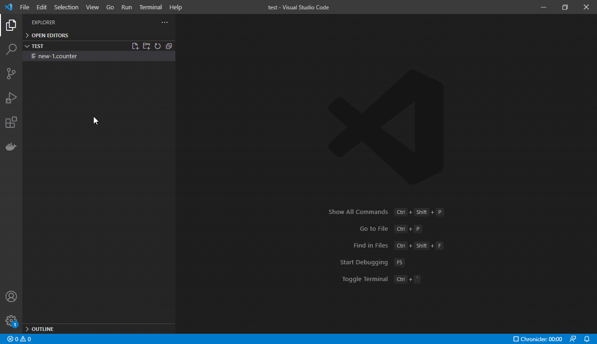
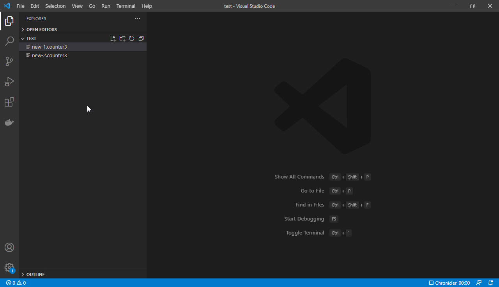

# VS Code Vue Custom Editor

This extension contains an example implementation of a [custom editor](https://code.visualstudio.com/api/extension-guides/custom-editors) written in the [Vue.js](https://v3.vuejs.org/).
As changes, the editor uses small objects called edit operations.
There is support for multiple views for one document.

Custom editor with inspector:

## License

[MIT](LICENSE)
